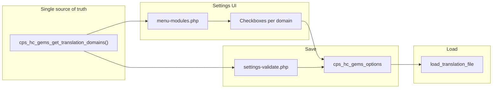

# Dynamic translation settings UI and validation — Spec and implementation

## Summary

Use the existing translation domains array (modules/translations.php — `cps_hc_gems_get_translation_domains()`) as the single source of truth to:

1. **Render checkboxes** in the modules settings page for all 403 domains (394 plugins + 9 themes), grouped and scrollable, with a search/filter.
2. **Validate and save** all translation option keys dynamically in settings/settings-validate.php by looping over the same getter.

Spec documentation will be saved first in `agent-os/specs/2026-01-31-1430-dynamic-translation-settings-ui-validation/`; then implementation tasks will follow.

---

## Task 1: Save spec documentation

Create `agent-os/specs/2026-01-31-1430-dynamic-translation-settings-ui-validation/` with:

- **plan.md** — This full plan (copy of the plan content).
- **shape.md** — Shaping notes: scope (dynamic UI + validation from array; scrollable list + search); decisions (single source of truth = getter; label = domain slug; validation loop); context (no visuals; references = menu-modules, settings-validate, settings-functions checkbox, 2026-01-30 translations spec); product alignment (user-centric, easy-to-use).
- **standards.md** — Note: `agent-os/standards/index.yml` is empty; no standards files to include. State "No project standards files apply; follow existing patterns in menu-modules and settings-validate."
- **references.md** — Pointers to: pages/menu-modules.php (current hardcoded translations block ~502–553), settings/settings-validate.php (lines 111–114), settings/settings-functions.php (`cps_hc_gems_form_field_checkbox`), modules/translations.php (`cps_hc_gems_get_translation_domains`, `cps_hc_gems_translation_domain_to_option_key`), and agent-os/specs/2026-01-30-1200-translations-single-level-config/ (recommended next steps).
- **visuals/** — Empty (`.gitkeep` only); user reported no visuals.

---

## Task 2: Dynamic validation for translation options

**File:** settings/settings-validate.php

- Remove the four hardcoded lines (111–114) that set `$input['translations-woocommerceapimanager']`, `translations-restrictcontentpro`, `translations-woocommercememberships`, `translations-woocommercesubscriptions`.
- After the block where other module checkboxes are sanitized, add a loop over `cps_hc_gems_get_translation_domains()`: merge `plugins` and `themes` arrays, then for each domain set  
`$input[ cps_hc_gems_translation_domain_to_option_key( $domain ) ] = ( isset( $input[ ... ] ) && 1 == $input[ ... ] ) ? 1 : 0;`  
so every translation option key is validated and defaulted to 0 when unchecked.
- Ensure the translations module is loaded before validation runs (it is, via plugin bootstrap).

---

## Task 3: Dynamic checkboxes in menu-modules (grouped, scrollable)

**File:** pages/menu-modules.php

- Replace the current "Translations for premium plugins & themes" block (hardcoded checkboxes ~508–513 and the static table ~515–552) with:
  - The same section title, pro notice, and short description.
  - Two subsections: **Plugins** and **Themes**, each with a heading and a scrollable list of checkboxes.
  - Loop over `cps_hc_gems_get_translation_domains()['plugins']` and output `cps_hc_gems_form_field_checkbox( $domain, cps_hc_gems_translation_domain_to_option_key( $domain ) )` for each (label = domain slug; no custom table links for now).
  - Same for `['themes']`.
  - Wrap each list in a container with a max-height and `uk-overflow-auto` (or equivalent) so the list is scrollable.
  - Remove the old static "Supported softwares" table (or replace with a short note that all listed domains above are supported, with link to docs if desired).

---

## Task 4: Search/filter for translation checkboxes

**File:** pages/menu-modules.php and optionally a small inline script or existing admin script

- Add a search input above the Plugins/Themes checkbox lists (e.g. a single text field with placeholder "Filter by name or domain").
- Implement client-side filter: on input, show only those checkbox list items whose label (domain) contains the search string (case-insensitive). Hide the others (e.g. via a data attribute on each checkbox list item and JS that toggles visibility or a CSS class).
- Use minimal, vanilla JS or existing UIkit if a suitable component exists; avoid new dependencies. Ensure the filter works for both Plugins and Themes sections (one search box for the whole translation block is sufficient).

---

## Data flow (reference)

---

## Verification

- All 403 domains appear as checkboxes (394 under Plugins, 9 under Themes).
- Saving the form persists every translation option; unchecked domains are stored as 0.
- Search/filter narrows the visible checkboxes by domain string.
- Existing behavior of `load_translation_file` (loading .mo/.l10n.php when option is set) remains unchanged; no changes to modules/translations.php in this spec beyond what is already done.
