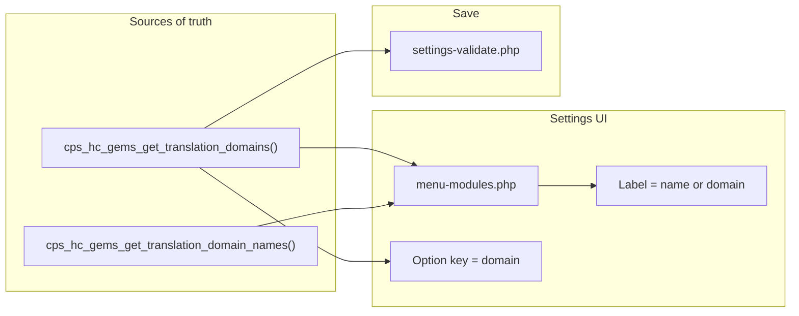

# Domain–name pairing for translation lists

## Goal

- Introduce a **domain → name** mapping (plugin/theme text domain → human-readable name).
- Use the **name** as the visible label in the translation checkbox lists (Plugins and Themes) instead of the domain slug.
- Keep validation and option keys **domain-based** (no change to validation logic).
- Save a new spec that includes this work plus the "recommended next steps" from [2026-01-31-1430-dynamic-translation-settings-ui-validation](agent-os/specs/2026-01-31-1430-dynamic-translation-settings-ui-validation/): dynamic checkboxes and validation from the domains array (already implemented); extend with names for display and ensure search works by both name and domain.

## Current state

- **Domains:** [modules/translations.php](modules/translations.php) — `cps_hc_gems_get_translation_domains()` returns `['plugins' => [...], 'themes' => [...]]` (394 plugins + 9 themes). Option key from `cps_hc_gems_translation_domain_to_option_key( $domain )`.
- **UI:** [pages/menu-modules.php](pages/menu-modules.php) (lines 501–558) — Translation section uses that getter; checkboxes are rendered with **domain** as label via `cps_hc_gems_form_field_checkbox( $domain, cps_hc_gems_translation_domain_to_option_key( $domain ) )`. Search filter matches the label text only (domain).
- **Validation:** [settings/settings-validate.php](settings/settings-validate.php) (lines 111–115) — Loops over `cps_hc_gems_get_translation_domains()` and validates each translation option key; no change needed for "use array for validations" (already domain-based).

## Data flow (after change)

## Task 1: Save spec documentation

Create **agent-os/specs/2026-01-31-HHMM-domain-name-pairing-translation-lists/** (use current date and time for HHMM) with:

- **plan.md** — This plan.
- **shape.md** — Scope: domain→name array; use name in lists; validation stays domain-based. Decisions: explicit name map with fallback (e.g. humanized domain) for missing entries; search by name and domain (data-domain on list item). Context: extends 2026-01-31-1430 spec; references menu-modules, translations.php, settings-validate, checkbox helper.
- **standards.md** — Note that agent-os/standards/index.yml is empty; follow existing patterns in menu-modules and translations.php.
- **references.md** — Pointers to relevant files and the 2026-01-31-1430 spec.
- **visuals/** — .gitkeep only unless visuals are provided.

Include in the spec the **already recommended next steps** from the existing dynamic translation spec:

- Use the **domains** array to render checkboxes (already implemented).
- Use the **domains** array for validation (already implemented).
- **New:** Use the **names** array (domain → name) to show the plugin/theme name in the lists; keep validation driven only by the domains array.

## Task 2: Add domain → name mapping in translations.php

**File:** [modules/translations.php](modules/translations.php)

- Add a new function, e.g. `cps_hc_gems_get_translation_domain_names()`, that returns an associative array `[ 'domain' => 'Human Name', ... ]` for all plugins and themes.
- **Implementation approach:** Build an explicit map for as many domains as practical. For any domain not in the map, fall back to a humanized form of the domain (e.g. replace `-`/`_` with spaces, then ucwords) so every domain has a display name without blocking on 403 manual entries on day one.
- Optionally document that the array can be extended over time with more explicit names.
- Keep `cps_hc_gems_get_translation_domains()` unchanged; validation and option keys continue to use domains only.

## Task 3: Use name as checkbox label and support search by name and domain

**File:** [pages/menu-modules.php](pages/menu-modules.php)

- In the Translations section, when looping over `cps_hc_gems_get_translation_domains()['plugins']` and `['themes']`: resolve display label from names (with fallback), pass **name** as the first argument to the checkbox helper, option key stays domain-based.
- Add `data-domain` on translation checkbox list items (extend checkbox helper or custom markup).
- Update the inline filter script to match search string against both visible label text and `data-domain` (case-insensitive).

## Task 4: Validation (no structural change)

**File:** [settings/settings-validate.php](settings/settings-validate.php)

- **No code change required.** Validation already loops over `cps_hc_gems_get_translation_domains()`. The names array is used only for display.

## Verification

- Every translation checkbox shows a human-readable name (from the new map or humanized domain).
- Saving the form still persists all translation options; unchecked domains are 0.
- Search/filter shows items that match either the displayed name or the domain.
- New domains added later get a display name via fallback until explicitly added to the names map.

## Files to touch

| File | Change |
|------|--------|
| agent-os/specs/2026-01-31-HHMM-domain-name-pairing-translation-lists/ | New spec folder (plan, shape, standards, references, visuals) |
| modules/translations.php | Add `cps_hc_gems_get_translation_domain_names()` (and optional fallback helper) |
| pages/menu-modules.php | Use name as label; add data-domain on translation items; update filter JS to match name + domain |
| settings/settings-functions.php | Optional: add parameter to checkbox helper for extra `<li>` attributes |
| settings/settings-validate.php | No change |
